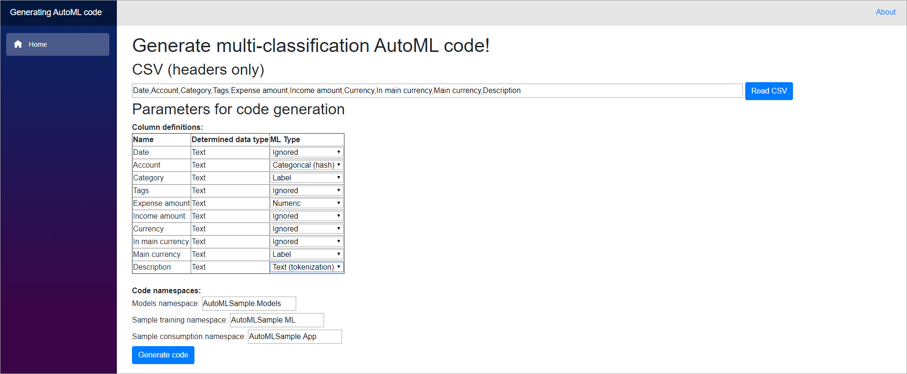
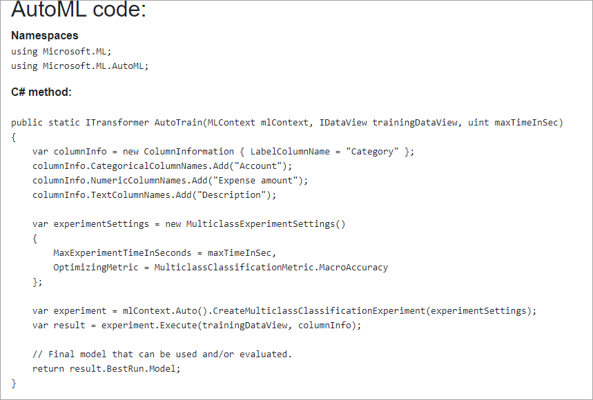

**NOTE:** Latest ML.NET Model Builder does solve the original problem of being unable to change column types. The generator is still useful, if you want to make your of custom ML.NET AutoML code. (ML.NET Model Builder will use a fix training algorithm once generated not AutoML API)

# Browser Code Generator for ML.NET

This project is used to demonstrate how to write ML.NET code to train and consume data.

Unlike ML.NET Model Builder and CLI, this tool is meant to be run in a modern browser and allows you to do quick customization that are not yet available in Model Builder!

You can try out live demo at https://jernejk.github.io/AutoML.CodeGenerator/

The demo will generate following code:

- Snippet for AutoML training (look image bellow)
- ModelInput and ModelOutput
- Sample console application `Program.cs` for you to try out:
  - Training app (uses the AutoML training snippet)
  - Consumption app

Examples of usage:

**Figure: Define CSV headers and specify what kind of column they are.**

**Figure: Generated ML.NET AutoML code that you copy/paste in your project!**

## Limitations:

- Will not work with all of the browsers! (client-side Blazor)
- Currently on multi-classification is implemented
   - More is coming after NDC Sydney (18th October 2019)
- ML.NET is not supported on client-side Blazor atm (which is why I didn't implement any actual training on the website 😫)
- The website doesn't actually generate a project for you. (but wouldn't that be cool? 😁)
- The website was created as part of a half weekend hackathon. May not follow best practices and need refactoring. 😂
